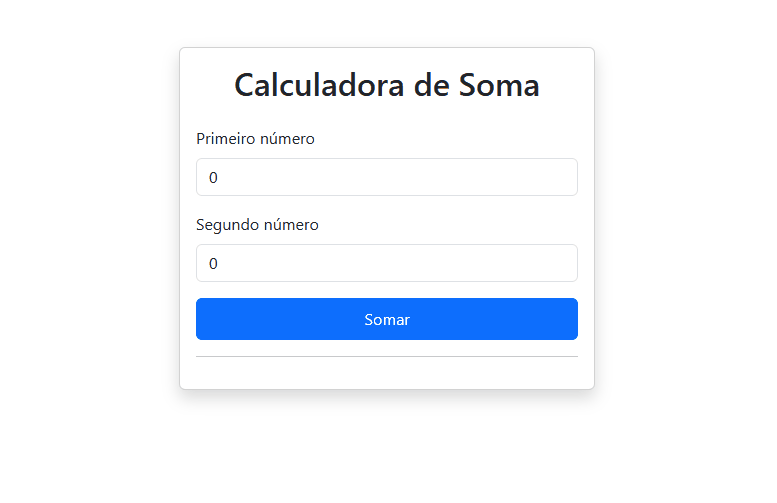

# Calculadora de Soma Básica

Esta é uma aplicação de calculadora desenvolvida para consolidar os fundamentos do **Angular 19**. O foco do projeto foi aplicar na prática conceitos de componentização, vinculação de dados (Data Binding) e integração com o **Bootstrap 5**.

## Demonstração

Para demonstrar o funcionamento da calculadora (interação entre os inputs, o evento de clique e a exibição do resultado), veja o fluxo abaixo:

<p align="center">
  
</p>

## Tecnologias e Ferramentas

* **Angular 19**: Desenvolvimento utilizando o padrão de *Standalone Components*.
* **Bootstrap 5**: Estilização global e layout responsivo aplicados via `angular.json`.
* **TypeScript**: Implementação da lógica de negócio e tipagem de dados.
* **SCSS**: Utilização de pré-processador para gerenciamento de estilos.
* **Git & Conventional Commits**: Padronização de mensagens de commit para um histórico profissional.

## Conceitos Praticados

* **Standalone Components**: Componentes autônomos sem a necessidade de `module.ts`.
* **Two-Way Data Binding (`[(ngModel)]`)**: Sincronização entre HTML e TypeScript.
* **Event Binding**: Captura de eventos de submissão de formulário via `(ngSubmit)`.
* **Interpolação**: Exibição dinâmica de dados através de `{{ }}`.
* **Nova Sintaxe de Controle**: Uso do `@if` do Angular 19 para exibição condicional do resultado.

## Como rodar o projeto localmente

Para executar este projeto em sua máquina, você precisará ter o [Node.js](https://nodejs.org/) e o [Angular CLI](https://angular.io/cli) instalados.

1.  **Clone este repositório**:
 
    ```bash
    git clone [https://github.com/josecampelo/calculadora-soma-basica-angular.git](https://github.com/josecampelo/calculadora-soma-basica-angular.git)
    ```
2.  **Acesse a pasta do projeto**:

    ```bash
    cd calculadora-soma-basica-angular
    ```
3.  **Instale as dependências (incluindo o Bootstrap)**:

    ```bash
    npm install
    ```
4.  **Inicie o servidor de desenvolvimento**:

    ```bash
    ng serve
    ```
5.  Abra o seu navegador no endereço: `http://localhost:4200/`.
